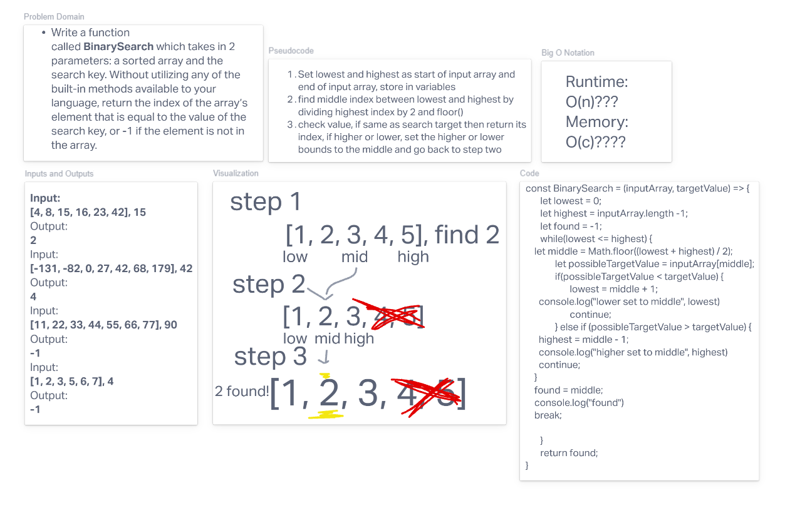

# Binary Search

Write a function called *BinarySearch* which takes in 2 parameters: a sorted array and the search key. Without utilizing any of the built-in methods available to your language, return the index of the array’s element that is equal to the value of the search key, or -1 if the element is not in the array.

## Whiteboard Process

- [Whiteboard Link](https://hugothompson412128.invisionapp.com/freehand/Code-Challenge-03-L6CfKcFkm?dsid_h=47ab9625b06b570add773dc2d0f8ba64c76621931051bb5fc5e85bf47b5fd215&uid_h=57a01461552e23c9b06490a5201ce45af7fd51d152bd7b362fae6918bd230b52)

## Approach & Efficiency

This was fairly straight forward until we got to the actual coding part. We were pretty close to the answer with our original logic, but needed a little push to get over the edge. We needed to adjust how we were shifting our new midpoints based on previous iterations through the while loop. I was proud of myself for hitting on some of the math ideas, while Hugo had the concept for the solution very, very close right from the beginning.

## Source

- [Binary Search](https://en.wikipedia.org/wiki/Binary_search_algorithm)
