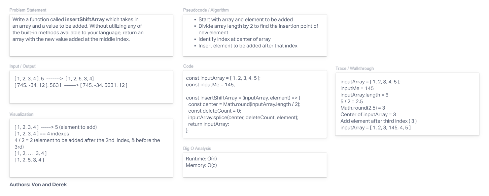

# Insert to Middle of an Array

This challenge was to go through the whiteboarding process to write a function called insertShiftArray. This function should insert a new element into the middle of an array. From speaking with David, moving forward into future challenges, I will avoid using more built-in methods. I used .splice in this case because it doesn't automatically do the function, but see how it should be broken down even more.

## Whiteboard Process

- [Whiteboard Link](https://derekdouglas365923.invisionapp.com/freehand/Code-Challenge-02-kxs1Pq2yL)

## Approach & Efficiency

We followed through with the steps we learned in class, beginning with the problem statement. From there we went to the input/output and then a visualization of what the function should look like from a more abstract perspective. Next time, I would incorporate arrows or some drawings to bring the visualization to life more. It was pseudocode from there until we were ready to write the code itself. We checked our work in replit and illustrated the walkthrough.

Again, next time I would write the code using less of the built-in methods.
