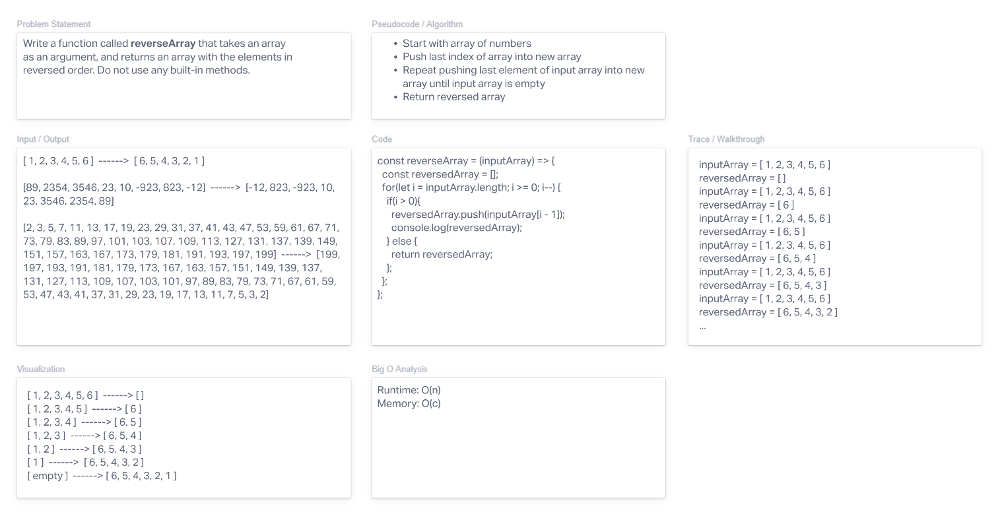

# Reverse an Array

Use a whiteboard process to illustrate the problem of reversing an input array.

## Whiteboard Process

- [Whiteboard Link](https://derekdouglas365923.invisionapp.com/freehand/Code-Challenge-01-pWjkCllOC?dsid_h=9ae495c15f4a38da38b65e8b7cc5ac65e12641f7fe1f1f93463782243e763822&uid_h=77b2dd8848d25cb9727f197c8994d77bbca91fa5d1984002d521e3fc86e765e2)

## Approach & Efficiency

I followed through with the steps we learned in class, beginning with the problem statement. From there I went to the input/output and then a visualization of what the function should look like from a more abstract perspective. It was pseudocode from there until I was ready to write the code itself. I checked my work in replit and illustrated the walkthrough.

My focus was on following the process that we used in class, and I used the lecture/demo we did with David as reference.
