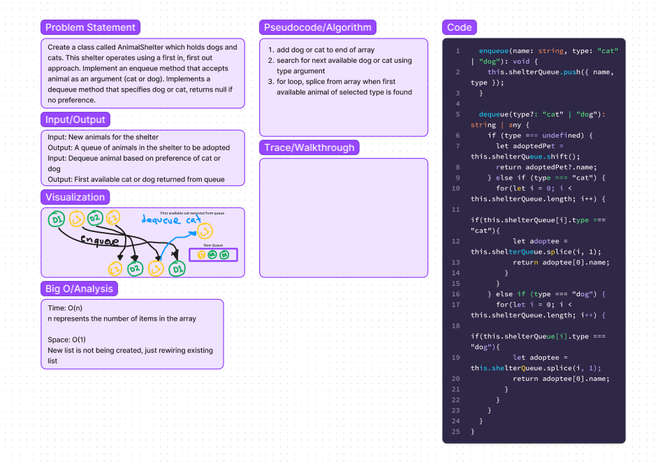

# Code Challenge 12

## Singly Linked List

I created a linked list using an ES6 Class in TypeScript. This singly linked list contains node that have an item and pointer to the next node. It is a singly linked list, because you can only traverse forward through the list. This was accomplished using a while loop and checking that the values weren't null (signifying the end of the list)

## Challenge

Use a queue for pet adoptions based on the type of animal requested.

## Whiteboard

## Approach & Efficiency

This was a fun challenge, I feel like parts of it were a throwback to code challenges from 201 and 301. Observation: it is much easier to work with arrays rather than linked lists.

## Collaborators

## API

N/A
